# Cryptographic Trust Layer for Enterprise AI

**Thesis:** As AI systems shift from generating outputs to executing actions, enterprises need a cryptographic enforcement layer that makes AI behavior verifiable, policy-bound, and auditable - with the same guarantees applied to financial transactions and code signing today.

---

## The Big Picture (10,000ft View)

**The Problem in Plain English:**

Today's AI takes actions. AI agents send emails, move money, change infrastructure settings, and coordinate with other AI agents, autonomously, faster than any human could review.

But here's the problem: there's no way to **prove** who authorized an AI to do something, what rules it was following, or whether those rules were tampered with. It's like having employees who can sign any contract, access any account, and make any purchase, with no receipts, no signatures, and no audit trail.

Current AI security tools (guardrails, prompt filters, logging) are like putting a suggestion box at the door of a bank vault. They *ask* AI to behave. They don't *enforce* it.

**What We're Building:**

A cryptographic enforcement layer that applies the same trust guarantees we require for financial transactions and code signing to every AI agent action. Before any agent can execute a consequential action, three things must happen:

1. **Identity verification** -- the agent authenticates via short-lived X.509 certificate, proving exactly which agent, running which model version, is requesting execution
2. **Policy-gated authorization** -- the action is evaluated against signed, versioned policy in real time. No standing privileges. Every action is individually adjudicated
3. **Cryptographic proof of authorization** -- the trust layer issues a signed, timestamped, non-repudiable receipt (Signed Action Envelope) binding identity, policy, and action into a single verifiable artifact

No valid signature, no execution. Not flagged. Not logged for later. **Blocked.**

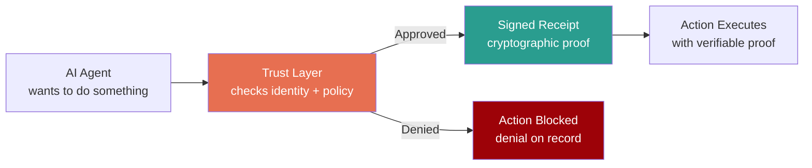

**A Simple Analogy:**

Think of how credit card transactions work today:
- Your card has an **identity** (card number, chip, issuing bank)
- Each purchase is **authorized in real-time** (Is this card valid? Is there enough credit? Is this purchase suspicious?)
- Every transaction produces a **signed, timestamped record** that both the bank and merchant can independently verify
- If the card is stolen, it can be **revoked instantly**, and all future transactions are blocked

We're building the exact same thing, but for AI agent actions instead of credit card purchases. Every AI action gets an identity check, a policy check, a cryptographic receipt, and the ability to be revoked in real-time.

**Three guarantees this provides:**

| Guarantee | What it means | Why it matters |
|---|---|---|
| **Verifiable** | Anyone can independently check if an AI action was properly authorized | No more "trust us, the AI was supposed to do that" |
| **Tamper-proof** | The record of what happened cannot be altered after the fact | Regulators, auditors, and incident responders get evidence, not just logs |
| **Enforceable** | Without cryptographic authorization, the action physically cannot execute | A locked gate, not a guardrail or a suggestion |

---

## 2. Threat Model: AI Agent Attack Surface

Nine attack vectors specific to agentic AI systems, mapped against what existing controls cover and where the gaps are.

```mermaid
graph LR
    subgraph "AI Agent Attack Chain"
        direction LR
        T1["T1 - Model Supply Chain<br/>Poisoned weights, backdoored adapters,<br/>typosquatted repos, training data attacks"]
        T2["T2 - Input Manipulation<br/>Prompt injection, RAG poisoning,<br/>jailbreaks, context manipulation"]
        T3["T3 - Identity and Authorization<br/>Agent impersonation, credential theft,<br/>privilege escalation via tool chaining"]
        T4["T4 - Action Execution<br/>Unauthorized API calls, replay attacks,<br/>TOCTOU between policy and execution"]
        T5["T5 - Output Integrity<br/>Insecure outputs, malicious URLs,<br/>code injection via generated content"]
        T6["T6 - Data Exfiltration<br/>Sensitive data leaks via model responses,<br/>training data extraction, PII exposure"]
        T7["T7 - Confabulation<br/>Hallucinated outputs presented as fact,<br/>fabricated citations, false attestations"]
        T8["T8 - Observability<br/>Log tampering, silent policy drift,<br/>broken causal chains across workflows"]
        T9["T9 - Cross-Boundary<br/>Rogue agent-to-agent traffic,<br/>unverified inter-org interactions"]
    end

    T1 --> T2 --> T3 --> T4 --> T5 --> T6 --> T7 --> T8 --> T9

    style T1 fill:#03071e,color:#fff
    style T2 fill:#370617,color:#fff
    style T3 fill:#6a040f,color:#fff
    style T4 fill:#9d0208,color:#fff
    style T5 fill:#d00000,color:#fff
    style T6 fill:#dc2f02,color:#fff
    style T7 fill:#e85d04,color:#fff
    style T8 fill:#f48c06,color:#fff
    style T9 fill:#faa307,color:#000
```

| Vector | Existing Coverage | Trust Layer Role |
|---|---|---|
| T1 - Supply Chain | SCA tools scan code dependencies; AI security platforms add model scanning and deserialization checks | Trust layer adds runtime hash verification, AI-SBOM provenance binding, and SLSA attestation -- proving the model in production matches the model that was approved |
| T2 - Input Manipulation | Guardrails, prompt filters, content classification | Addressed at input by runtime security platforms. Trust layer hardens the boundary: even if injection succeeds, execution requires signed authorization |
| T3 - Identity | IAM, RBAC, posture management | Agents inherit service account privileges. Trust layer enforces per-agent, per-action cryptographic identity via short-lived X.509 certificates |
| T4 - Execution | API gateways, rate limits, agent policy enforcement | No cryptographic binding between policy decision and action execution. Trust layer closes this with signed action envelopes and TOCTOU-safe enforcement |
| T5 - Output Integrity | AI runtime security platforms scan outputs for malicious content, URLs, and code injection | Trust layer adds signed provenance: the output can be traced back to the exact agent, model version, and policy that produced it |
| T6 - Data Exfiltration | DLP, content filtering, topic guardrails in AI agent security platforms | Trust layer adds policy-gated enforcement on data-touching actions: outbound data transfers require signed authorization matching data classification policy |
| T7 - Confabulation | Hallucination detection via grounding checks against knowledge sources | Outside the trust layer's scope. This is a model fidelity problem best addressed at the application and runtime security layer |
| T8 - Observability | SIEM, logging, continuous monitoring platforms | Logs are mutable. Trust layer provides tamper-evident, Merkle-anchored chain of custody for all AI actions |
| T9 - Cross-Boundary | mTLS at network layer | No application-layer agent identity. Trust layer adds signed intent verification and cross-agent SAE chains |

The trust layer closes T1, T3, T4, T8, and T9 directly. It strengthens T2, T5, and T6 by adding cryptographic enforcement beneath existing runtime security controls. T7 (confabulation) is correctly addressed at the application layer and is out of scope for cryptographic enforcement.

---

## 3. Architecture Overview

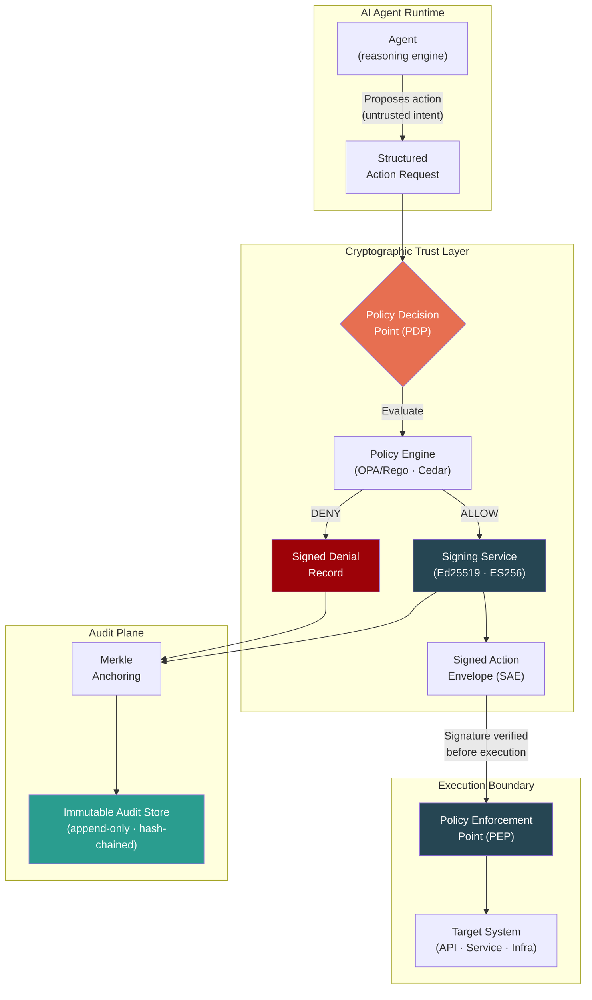

The architecture separates three concerns: the **Policy Decision Point** evaluates whether an action is permitted, the **Signing Service** produces the cryptographic proof, and the **Policy Enforcement Point** at the execution boundary refuses to execute anything without a valid signature. This separation means a compromised agent cannot bypass enforcement - it does not hold signing keys.

---

## 4. Deployment Topology

Three deployment models depending on where the enterprise is in its agent maturity.

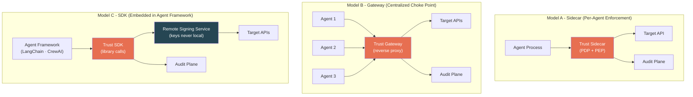

| Model | Latency | Control Granularity | Deployment Effort | Best For |
|---|---|---|---|---|
| **Sidecar** | <5ms (local PDP) | Per-agent, per-action | Medium (K8s DaemonSet/sidecar injection) | Kubernetes-native agent deployments |
| **Gateway** | 10-30ms (network hop) | Centralized policy, all agents | Low (reverse proxy, no agent changes) | Rapid deployment, legacy agent systems |
| **SDK** | <2ms (in-process) + signing RTT | Deepest (pre-action hooks) | High (code integration) | Agent framework developers, tight control |

In all three models, **signing keys never reside on the agent**. The agent can request execution but cannot self-authorize. This is the hard separation between intelligence and authority.

---

## 5. PKI Architecture & Key Management

The first question any security architect asks: *who holds the keys, how are they managed, and what happens when they're compromised?*

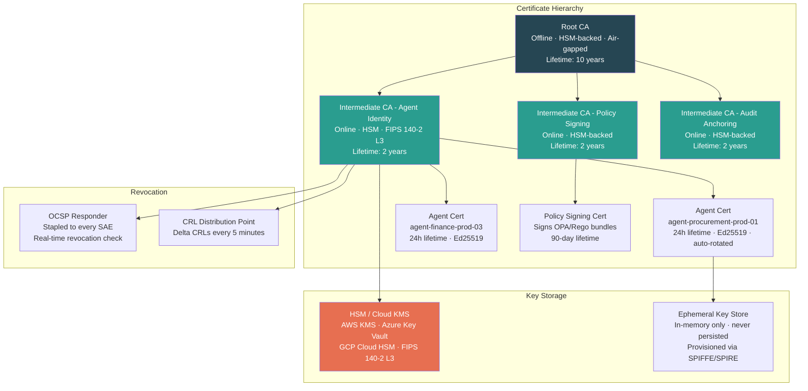

Key design decisions:

- **Short-lived agent certificates (24h)** limit the blast radius of key compromise. Automatic rotation via SPIFFE/SPIRE eliminates manual certificate management.
- **Signing keys are never on the agent.** Agents authenticate to the signing service, which holds keys in HSM. The agent proves identity; the service produces the signature.
- **Separate CA chains** for agent identity, policy signing, and audit anchoring. Compromise of one chain does not compromise the others.
- **OCSP stapling on every SAE** means the verifier can confirm the signing certificate was valid at the exact moment of signing without a network call to the CA.

---

## 6. Data Plane / Control Plane Separation

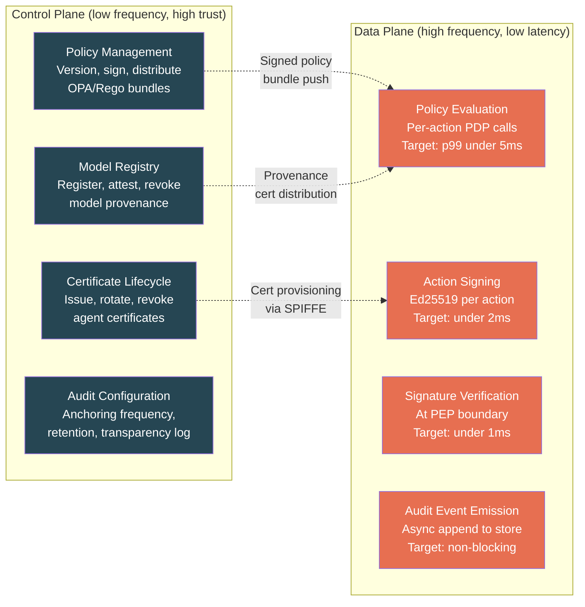

The control plane is secured with higher privilege and lower frequency access. The data plane is optimized for per-action evaluation at low latency. Policy bundles are signed and pushed to local PDP caches - the data plane never calls back to the control plane during action evaluation. This eliminates the control plane as a latency bottleneck and as a single point of failure.

**Latency budget for the full trust layer inline path:**

| Step | Target p99 | Notes |
|---|---|---|
| Policy evaluation (PDP) | <5ms | Local OPA evaluation against cached signed bundle |
| Cryptographic signing | <2ms | Ed25519 is fast; HSM-backed ES256 adds ~1ms |
| Signature verification (PEP) | <1ms | Ed25519 verify is sub-millisecond |
| Audit emission | 0ms (async) | Fire-and-forget to local buffer, batched to store |
| **Total inline overhead** | **<8ms p99** | Comparable to a service mesh sidecar hop |

For context: an LLM inference call takes 500ms-5s. An 8ms enforcement layer is noise.

---

## 7. The Signed Action Envelope (SAE)

The atomic unit of trust. A JWS-format object that cryptographically binds identity, policy, action, provenance, and timestamp into a single verifiable artifact.

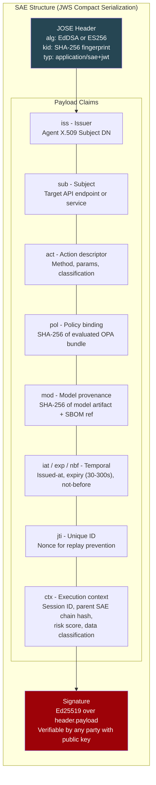

**What this gives you that logs do not:**

| Property | How |
|---|---|
| Non-repudiation | Asymmetric signature - the signing key is in HSM, not on the agent |
| Integrity | Any byte change invalidates the signature |
| Replay prevention | Short-lived expiry + unique `jti` nonce |
| Policy binding | `pol` claim locks the exact policy version evaluated - detects retroactive policy changes |
| Provenance binding | `mod` claim locks the exact model hash - detects model swaps |
| Causal chaining | `ctx.parent_chain` links multi-step agent workflows into a verifiable DAG |
| Independent verifiability | Any party with the public key and OCSP response can verify, offline |

---

## 8. Multi-Agent Workflow: Chain of Custody

Real agent systems are not single-step. A procurement workflow might chain 4-5 agents across systems. The trust layer maintains cryptographic chain of custody across the entire execution DAG.

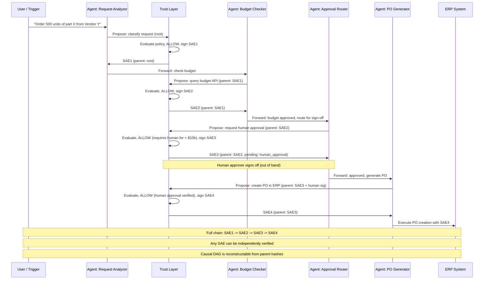

Every step is independently signed. The `parent_chain` field in each SAE points to the hash of the previous SAE, forming a verifiable directed acyclic graph. During incident response or audit, the entire causal chain can be reconstructed and cryptographically verified - from trigger to execution.

---

## 9. Kill Chain & Mitigation Mapping

Mapping trust layer controls against an AI-specific attack lifecycle.

```mermaid
graph TB
    subgraph "AI Agent Kill Chain with Trust Layer Coverage"
        direction TB

        KC1["1. RECONNAISSANCE<br/>Map agent capabilities and scope"]
        M1["Mitigation: Capability obfuscation,<br/>minimal tool surface exposure"]

        KC2["2. SUPPLY CHAIN<br/>Poisoned weights, malicious adapters"]
        M2["Mitigation: Model provenance via AI-SBOM,<br/>SLSA attestation, runtime hash verification"]

        KC3["3. INITIAL ACCESS<br/>Prompt injection, RAG poisoning"]
        M3["Mitigation: Even if injection succeeds,<br/>execution requires signed authorization"]

        KC4["4. EXECUTION<br/>Unauthorized API calls, replay"]
        M4["Mitigation: Policy-gated signing,<br/>SAE with nonce + expiry, TOCTOU-safe"]

        KC5["5. PRIVILEGE ESCALATION<br/>Tool chaining, inherited permissions"]
        M5["Mitigation: Per-action least privilege,<br/>JIT scoping, short-lived certs (24h)"]

        KC6["6. LATERAL MOVEMENT<br/>Agent-to-agent pivoting"]
        M6["Mitigation: mTLS agent mesh,<br/>signed cross-agent SAEs, allowlisting"]

        KC7["7. OUTPUT MANIPULATION<br/>Insecure outputs, malicious content,<br/>data exfiltration via responses"]
        M7["Mitigation: Runtime security platforms<br/>scan outputs. Trust layer adds signed<br/>provenance binding to every response"]

        KC8["8. IMPACT<br/>Data exfil, financial fraud, infra damage"]
        M8["Mitigation: Immutable audit trail,<br/>auto quarantine, forensic chain of custody"]
    end

    KC1 --- M1
    KC2 --- M2
    KC3 --- M3
    KC4 --- M4
    KC5 --- M5
    KC6 --- M6
    KC7 --- M7
    KC8 --- M8

    style KC1 fill:#264653,color:#fff
    style KC2 fill:#264653,color:#fff
    style KC3 fill:#264653,color:#fff
    style KC4 fill:#264653,color:#fff
    style KC5 fill:#264653,color:#fff
    style KC6 fill:#264653,color:#fff
    style KC7 fill:#264653,color:#fff
    style KC8 fill:#264653,color:#fff
    style M2 fill:#e76f51,color:#fff
    style M3 fill:#e76f51,color:#fff
    style M4 fill:#e76f51,color:#fff
    style M5 fill:#e76f51,color:#fff
    style M6 fill:#e76f51,color:#fff
    style M7 fill:#e9c46a,color:#000
    style M8 fill:#e76f51,color:#fff
```

AI security platforms increasingly address Stages 2, 3, and 7 with model scanning, input filtering, and output guardrails. The trust layer covers Stages 2, 4, 5, 6, and 8 -- the execution and post-execution stages where autonomous action creates actual damage. At Stage 7, the trust layer complements runtime output scanning by binding provenance to every output.

---

## 10. Integration Architecture: SIEM / XDR / SOAR

The trust layer is not a standalone product. It emits structured events into the existing security operations stack and consumes signals from it.

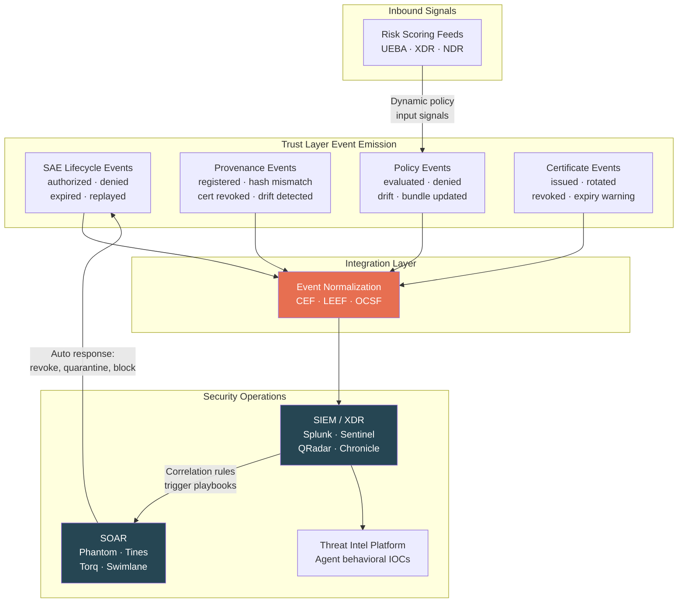

The integration is bidirectional. The trust layer emits events into SIEM for correlation and alerting. SOAR playbooks can call back into the trust layer to revoke certificates, quarantine agents, or block models. Risk scores from XDR/UEBA feed into the policy engine as dynamic context - so a high-risk endpoint score can automatically elevate the policy threshold for agents running on that endpoint.

**Event schema:** All events conform to OCSF (Open Cybersecurity Schema Framework) for vendor-neutral ingestion, with CEF/LEEF mappings for legacy SIEM compatibility.

---

## 11. Runtime Attestation: Continuous Verification

Deployment-time verification is insufficient. The trust layer performs continuous runtime checks on five dimensions.

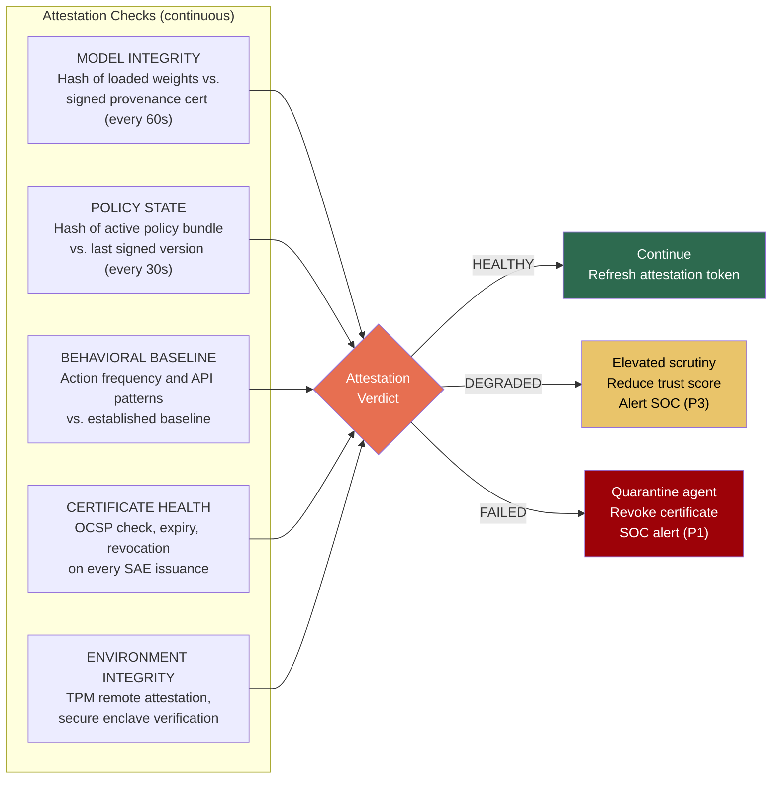

The three-state model (healthy / degraded / failed) avoids the binary problem of hard-blocking on transient issues. A degraded state tightens controls without killing the agent - similar to how EDR can quarantine a process vs. killing it.

---

## 12. Immutable Audit: Tiered Anchoring

Not every AI event needs cryptographic immutability. The trust layer applies tiered anchoring based on trust criticality.

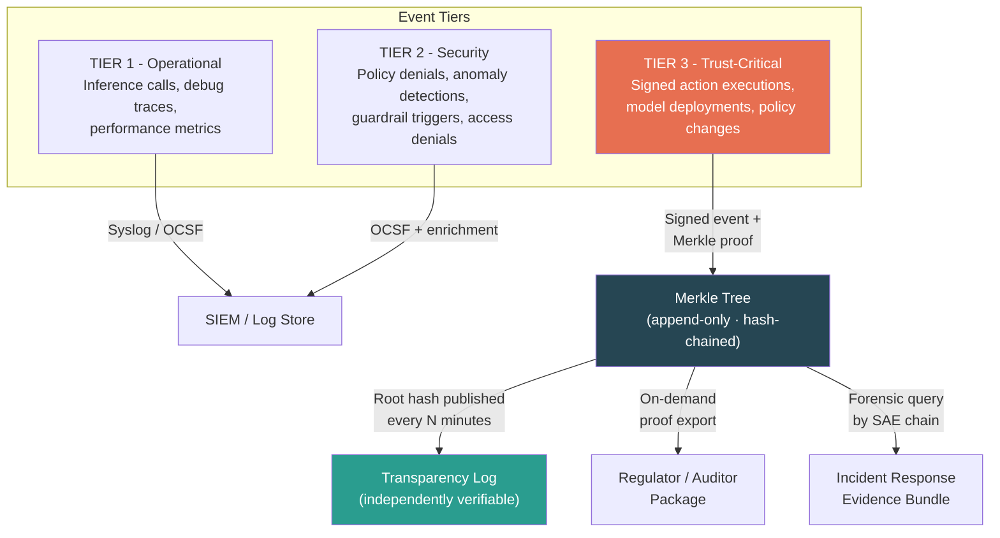

The transparency log model is borrowed from Certificate Transparency (RFC 6962). Merkle roots are published on a fixed schedule. Any party can independently verify that a specific event was included in the log at the claimed time - without trusting the log operator.

---

## 13. Incident Response: Forensic Workflow

Scenario: SOC detects an unauthorized $200k wire transfer initiated by an AI agent.

Without the trust layer: the SOC reconstructs this from scattered, mutable logs across 4+ systems. It takes days. The evidence is legally contestable. With the trust layer: cryptographic proof in minutes, including the exact policy version that was tampered with.

---

## 14. Defense-in-Depth: Where This Sits

Layer 3 does not replace anything above or below it. It makes the decisions at every other layer **provable**. Layer 5 -- where AI security platforms provide model scanning, runtime protection, agent guardrails, and red teaming -- makes content-level and behavioral decisions. Layer 3 provides the cryptographic substrate that binds those decisions to verifiable proof. Layer 5 detects a risky prompt -- Layer 3 proves the action was blocked. Layer 4 decides an agent lacks permission -- Layer 3 produces a signed denial. Layer 1 detects an endpoint anomaly -- Layer 3 consumes that signal to tighten policy thresholds. The trust layer is the enforcement backbone that the rest of the stack depends on for non-repudiation.

---

## 15. Zero Trust for AI: NIST 800-207 Mapping

| NIST ZTA Principle | Traditional Implementation | AI Trust Layer Implementation |
|---|---|---|
| All resources require verification | Device posture, user identity | Agent identity (X.509), model provenance, tool attestation |
| Communication secured regardless of location | mTLS, VPN, ZTNA | mTLS agent mesh + signed action envelopes |
| Per-session resource access | Session tokens, JIT access | Per-action policy evaluation, no standing privileges |
| Dynamic policy enforcement | ABAC, risk-adaptive access | OPA/Rego with real-time context (risk score, time, classification) |
| Continuous monitoring of asset posture | EDR, UEBA, vulnerability scanning | Runtime attestation (model hash, policy drift, behavior baseline) |
| Strict authentication and authorization | MFA, SSO, conditional access | Cryptographic enforcement - no execution without valid SAE |

---

## 16. Regulatory Alignment

| Regulation | Key Requirement | Trust Layer Mapping |
|---|---|---|
| **EU AI Act** | Traceability, logging, human oversight for high-risk AI | SAE chain of custody, policy-gated human escalation |
| **NIST AI RMF** | Govern, Map, Measure, Manage AI risk | Provenance, attestation, continuous policy evaluation |
| **SOX §404** | Internal controls over financial reporting | Signed authorization for financial AI actions |
| **DORA** | Digital operational resilience (EU financial sector) | Immutable audit, incident reconstruction, third-party agent risk |
| **PCI DSS v4.0** | Cardholder data protection | DLP integration via policy engine, signed actions on payment APIs |
| **FedRAMP / FISMA** | Continuous monitoring, tamper-evident logging | Runtime attestation, Merkle-anchored audit |
| **ISO 27001:2022** | Information security management | Agent PKI, access control, audit trail |

---

## Appendix A: Glossary

| Term | Definition |
|---|---|
| **SAE** | Signed Action Envelope - JWS object binding agent identity, policy, action, provenance, and timestamp into a single verifiable artifact |
| **PDP** | Policy Decision Point - evaluates whether an action is permitted under current policy |
| **PEP** | Policy Enforcement Point - verifies SAE signature at execution boundary; rejects unsigned actions |
| **AI-SBOM** | AI Software Bill of Materials - manifest of model components: base model, fine-tune data, adapters, dependencies |
| **SLSA** | Supply-chain Levels for Software Artifacts - framework for supply chain integrity applied to model provenance |
| **SPIFFE/SPIRE** | Secure Production Identity Framework - standard for issuing and rotating workload identities; used for agent certificate provisioning |
| **OPA/Rego** | Open Policy Agent - policy-as-code engine; Rego is its declarative query language |
| **Cedar** | Amazon's policy language - alternative to Rego for fine-grained authorization |
| **OCSF** | Open Cybersecurity Schema Framework - vendor-neutral event schema for SIEM interoperability |
| **CEF/LEEF** | Common Event Format / Log Event Extended Format - standard event formats for SIEM ingestion |
| **TOCTOU** | Time-of-Check to Time-of-Use - race condition between policy evaluation and action execution |
| **OCSP** | Online Certificate Status Protocol - real-time certificate revocation checking |
| **mTLS** | Mutual TLS - both parties authenticate via certificates during TLS handshake |
| **HSM** | Hardware Security Module - tamper-resistant hardware for key storage and cryptographic operations |
| **Merkle Tree** | Hash tree structure where each leaf is hashed and combined upward; enables efficient and verifiable proof of inclusion |

---

## Appendix B: Open Questions

Areas where I am looking for feedback and pressure-testing from security leaders.

1. **Build vs. buy signal** - At what point do enterprise security platforms absorb this as a feature vs. this standing alone as a category? What signals should I watch for?
2. **Agent identity standard** - No industry standard exists yet for AI agent identity. Is this a SPIFFE extension? A new X.509 profile? Or something entirely new?
3. **Policy language** - OPA/Rego vs. Cedar vs. custom DSL. What are enterprises actually adopting for policy-as-code today?
4. **Confidential computing** - How far should I push TEE-based attestation (SGX/TDX/SEV-SNP) vs. software-only? Is customer readiness there?
5. **Multi-cloud key management** - Unified HSM abstraction across AWS KMS, Azure Key Vault, GCP Cloud HSM, or vendor-specific integrations first?
6. **Scale testing** - What happens at 10,000 agents generating 1M+ SAEs per hour? Where do the Merkle tree and audit store become bottlenecks?
7. **Go-to-market** - Should this land first with the CISO organization, platform engineering, or AI/ML teams? Who owns this budget?
