# Cryptographic Trust Layer for Enterprise AI

**Thesis:** As AI systems shift from generating outputs to executing actions, enterprises need a smart contract-based enforcement layer that makes AI behavior verifiable, policy-bound, and auditable - with the same on-chain guarantees applied to financial transactions on blockchain today.

---

## The Big Picture (10,000ft View)

**The Problem in Plain English:**

Today's AI takes actions. AI agents send emails, move money, change infrastructure settings, and coordinate with other AI agents, autonomously, faster than any human could review.

But here's the problem: there's no way to **prove** who authorized an AI to do something, what rules it was following, or whether those rules were tampered with. It's like having employees who can sign any contract, access any account, and make any purchase, with no receipts, no signatures, and no audit trail.

Current AI security tools (guardrails, prompt filters, logging) are like putting a suggestion box at the door of a bank vault. They *ask* AI to behave. They don't *enforce* it.

**What We're Building:**

A smart contract-based enforcement layer that applies the same trust guarantees we require for financial transactions to every AI agent action. Policies are deployed as smart contracts on an Ethereum L2. Before any agent can execute a consequential action, three things must happen:

1. **Identity verification**: the agent authenticates via short-lived X.509 certificate, proving exactly which agent, running which model version, is requesting execution
2. **Smart contract policy evaluation**: the action is validated against policy logic encoded in on-chain smart contracts. No standing privileges. Every action is individually adjudicated by immutable, versioned contract code
3. **On-chain anchored proof**: the trust layer issues a signed, timestamped receipt (Signed Action Envelope) and anchors its hash on-chain, creating an immutable, independently verifiable proof of authorization

No valid signature, no execution. Not flagged. Not logged for later. **Blocked.**

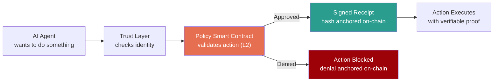

**A Simple Analogy:**

Think of how smart contracts enforce DeFi transactions today:
- A protocol's rules are **deployed as immutable code** on-chain: no one can change them without a versioned upgrade visible to everyone
- Each transaction is **validated against that code** in real time: if the conditions aren't met, the transaction reverts
- Every execution produces an **on-chain event log** that anyone can independently verify, forever
- If an address needs to be blocked, governance can **update the contract state** and all future transactions from that address are rejected

We're building the exact same model, but for AI agent actions instead of token transfers. Every AI action gets an identity check, a smart contract policy check, a cryptographic receipt anchored on-chain, and the ability to be revoked in real-time.

**Three guarantees this provides:**

| Guarantee | What it means | Why it matters |
|---|---|---|
| **Verifiable** | Anyone can independently check on-chain whether an AI action was properly authorized | No more "trust us, the AI was supposed to do that": the proof is on a public ledger |
| **Tamper-proof** | The on-chain record of what happened cannot be altered after the fact | Regulators, auditors, and incident responders get blockchain-anchored evidence, not mutable logs |
| **Enforceable** | Without cryptographic authorization from the smart contract, the action physically cannot execute | A locked gate backed by immutable code, not a guardrail or a suggestion |

---

## 2. Threat Model: AI Agent Attack Surface

Nine attack vectors specific to agentic AI systems, mapped against what existing controls cover and where the gaps are.

```mermaid
graph LR
    subgraph "AI Agent Attack Chain"
        direction LR
        T1["T1 - Model Supply Chain<br/>Poisoned weights, backdoored adapters,<br/>typosquatted repos, training data attacks"]
        T2["T2 - Input Manipulation<br/>Prompt injection, RAG poisoning,<br/>jailbreaks, context manipulation"]
        T3["T3 - Identity and Authorization<br/>Agent impersonation, credential theft,<br/>privilege escalation via tool chaining"]
        T4["T4 - Action Execution<br/>Unauthorized API calls, replay attacks,<br/>TOCTOU between policy and execution"]
        T5["T5 - Output Integrity<br/>Insecure outputs, malicious URLs,<br/>code injection via generated content"]
        T6["T6 - Data Exfiltration<br/>Sensitive data leaks via model responses,<br/>training data extraction, PII exposure"]
        T7["T7 - Confabulation<br/>Hallucinated outputs presented as fact,<br/>fabricated citations, false attestations"]
        T8["T8 - Observability<br/>Log tampering, silent policy drift,<br/>broken causal chains across workflows"]
        T9["T9 - Cross-Boundary<br/>Rogue agent-to-agent traffic,<br/>unverified inter-org interactions"]
    end

    T1 --> T2 --> T3 --> T4 --> T5 --> T6 --> T7 --> T8 --> T9

    style T1 fill:#03071e,color:#fff
    style T2 fill:#370617,color:#fff
    style T3 fill:#6a040f,color:#fff
    style T4 fill:#9d0208,color:#fff
    style T5 fill:#d00000,color:#fff
    style T6 fill:#dc2f02,color:#fff
    style T7 fill:#e85d04,color:#fff
    style T8 fill:#f48c06,color:#fff
    style T9 fill:#faa307,color:#000
```

| Vector | Existing Coverage | Trust Layer Role |
|---|---|---|
| T1 - Supply Chain | SCA tools scan code dependencies; AI security platforms add model scanning and deserialization checks | Runtime hash verification with provenance hashes registered on-chain, so the model in production can be verified against an immutable record |
| T2 - Input Manipulation | Guardrails, prompt filters, content classification | Addressed at input by runtime security platforms. Trust layer hardens the boundary: even if injection succeeds, execution requires smart contract-validated authorization |
| T3 - Identity | IAM, RBAC, posture management | Agents inherit service account privileges. Trust layer enforces per-agent, per-action cryptographic identity via short-lived X.509 certificates with an on-chain agent registry mapping identities to approved capabilities |
| T4 - Execution | API gateways, rate limits, agent policy enforcement | Policy smart contracts validate every action before signing, eliminating TOCTOU via immutable on-chain policy state |
| T5 - Output Integrity | AI runtime security platforms scan outputs for malicious content, URLs, and code injection | Trust layer adds signed provenance: the output can be traced back to the exact agent, model version, and smart contract policy version that produced it |
| T6 - Data Exfiltration | DLP, content filtering, topic guardrails in AI agent security platforms | Trust layer adds smart contract-gated enforcement on data-touching actions: outbound data transfers require authorization validated against on-chain data classification policy |
| T7 - Confabulation | Hallucination detection via grounding checks against knowledge sources | Outside the trust layer's scope. This is a model fidelity problem best addressed at the application and runtime security layer |
| T8 - Observability | SIEM, logging, continuous monitoring platforms | Logs are mutable. Trust layer anchors SAE hashes on-chain, providing a blockchain-backed, tamper-proof chain of custody for all AI actions |
| T9 - Cross-Boundary | mTLS at network layer | Organizations share a common L2 for policy verification: cross-org agent interactions are validated against each organization's on-chain policy contracts |

The trust layer closes T1, T3, T4, T8, and T9 directly. It strengthens T2, T5, and T6 by adding smart contract enforcement beneath existing runtime controls. T7 (confabulation) is out of scope. T9 (cross-boundary) is where smart contracts provide the strongest advantage: a shared L2 eliminates bilateral trust agreements between organizations.

---

## 3. Architecture Overview

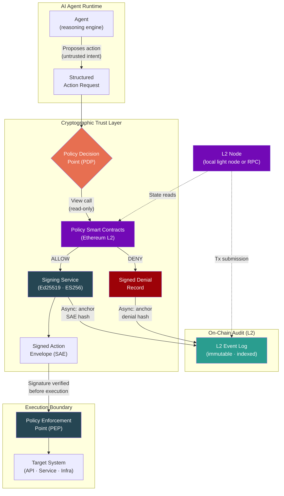

Three concerns are separated: the **PDP** calls view functions on policy smart contracts (L2), the **Signing Service** produces cryptographic proof and anchors the SAE hash on-chain, and the **PEP** at the execution boundary rejects anything without a valid signature. A compromised agent cannot bypass enforcement: it holds neither signing keys nor wallet keys.

---

## 4. Deployment Topology

Three deployment models depending on where the enterprise is in its agent maturity. All models require L2 node access for smart contract reads and SAE hash anchoring.

```mermaid
graph TB
    subgraph "Model A - Sidecar (Per-Agent Enforcement)"
        direction LR
        A1["Agent Process"] --> A2["Trust Sidecar<br/>(PDP + PEP)"]
        A2 --> A3["Target API"]
        A2 -->|"View calls +<br/>hash anchoring"| A4["L2 Node<br/>(shared RPC)"]
    end

    subgraph "Model B - Gateway (Centralized Choke Point)"
        direction LR
        B1["Agent 1"] --> B4["Trust Gateway<br/>(reverse proxy)"]
        B2["Agent 2"] --> B4
        B3["Agent 3"] --> B4
        B4 --> B5["Target APIs"]
        B4 -->|"View calls +<br/>hash anchoring"| B6["L2 Node<br/>(gateway-local)"]
    end

    subgraph "Model C - SDK (Embedded in Agent Framework)"
        direction LR
        C1["Agent Framework<br/>(LangChain · CrewAI)"] --> C2["Trust SDK<br/>(library calls)"]
        C2 --> C3["Remote Signing Service<br/>(keys never local)"]
        C3 --> C4["Target APIs"]
        C2 -->|"View calls"| C5["L2 RPC Provider"]
        C3 -->|"Hash anchoring"| C5
    end

    style A2 fill:#e76f51,color:#fff
    style B4 fill:#e76f51,color:#fff
    style C2 fill:#e76f51,color:#fff
    style C3 fill:#264653,color:#fff
    style A4 fill:#7209b6,color:#fff
    style B6 fill:#7209b6,color:#fff
    style C5 fill:#7209b6,color:#fff
```

| Model | Inline Latency | Chain Access | Deployment Effort | Best For |
|---|---|---|---|---|
| **Sidecar** | <5ms (local view call) | Shared L2 RPC endpoint | Medium (K8s DaemonSet/sidecar injection) | Kubernetes-native agent deployments |
| **Gateway** | 10-30ms (network hop) | Gateway-local L2 node, agents need no chain access | Low (reverse proxy, no agent changes) | Rapid deployment, legacy agent systems |
| **SDK** | <2ms (in-process view call) + signing RTT | SDK wraps L2 RPC calls | High (code integration) | Agent framework developers, tight control |

In all three models, **signing keys and wallet keys never reside on the agent**. The agent can request execution but cannot self-authorize or submit on-chain transactions. SAE hash anchoring is asynchronous and does not add to inline latency.

---

## 5. Key Management: PKI + Blockchain Keys

The first question any security architect asks: *who holds the keys, how are they managed, and what happens when they're compromised?* The trust layer maintains two key hierarchies: traditional PKI for agent identity and SAE signing, and blockchain wallet keys for smart contract operations and on-chain anchoring.

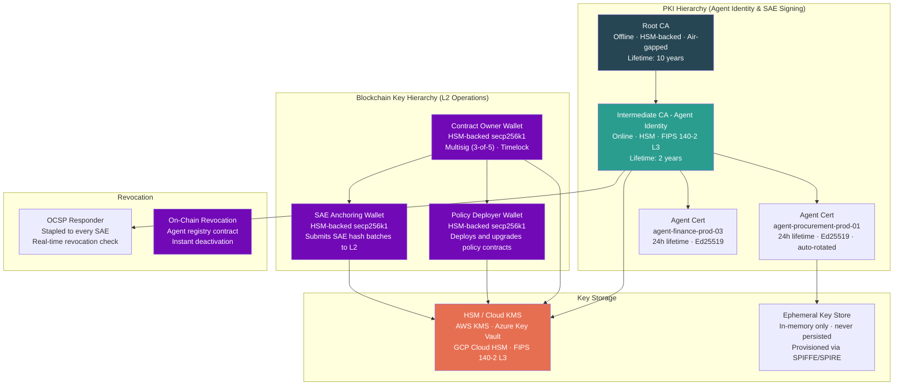

Key design decisions:

- **Short-lived agent certificates (24h)** limit the blast radius of key compromise. Automatic rotation via SPIFFE/SPIRE eliminates manual certificate management.
- **Signing keys and wallet keys are never on the agent.** Agents authenticate to the signing service, which holds keys in HSM. The agent proves identity; the service produces the signature and submits on-chain anchoring transactions.
- **Separate PKI and blockchain key hierarchies.** Compromise of the PKI chain does not give an attacker the ability to modify smart contracts, and vice versa.
- **Contract owner is a multisig with timelock.** Policy contract upgrades require 3-of-5 signatures and a configurable delay (e.g., 24h), making hostile takeover of policy logic publicly visible before it takes effect.
- **HSM-backed blockchain keys.** All wallet keys (contract owner, policy deployer, SAE anchorer) are backed by HSMs. AWS KMS natively supports secp256k1 signing, enabling Ethereum transaction signing without exposing private keys.
- **Dual revocation path.** OCSP for certificate revocation, on-chain agent registry for instant deactivation.
- **OCSP stapling on every SAE** means the verifier can confirm the signing certificate was valid at the exact moment of signing without a network call to the CA.

---

## 6. Data Plane / Control Plane Separation

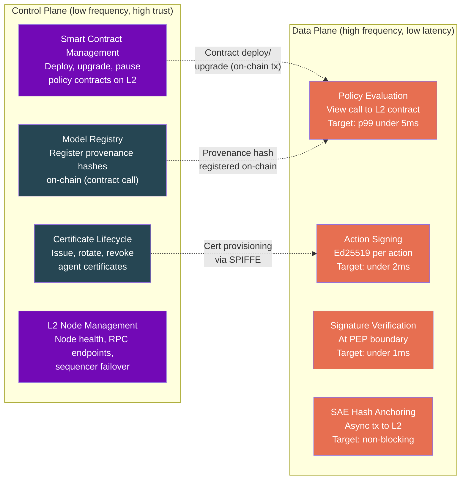

The control plane is secured with higher privilege and lower frequency access. Smart contract deployments and upgrades require multisig authorization and timelock delays. The data plane is optimized for per-action evaluation at low latency. Policy evaluation reads from L2 contract state via view calls: read-only, no gas, executed against cached chain state. The data plane never submits on-chain transactions in the critical path.

**Latency budget for the full trust layer inline path:**

| Step | Target p99 | Notes |
|---|---|---|
| Policy evaluation (PDP) | <5ms | View call to L2 contract state (local node or cached RPC) |
| Cryptographic signing | <2ms | Ed25519 is fast; HSM-backed ES256 adds ~1ms |
| Signature verification (PEP) | <1ms | Ed25519 verify is sub-millisecond |
| SAE hash anchoring | 0ms (async) | Fire-and-forget L2 transaction, confirmed in 1-4s out of band |
| **Total inline overhead** | **<8ms p99** | Comparable to a service mesh sidecar hop |

For context: an LLM inference call takes 500ms-5s. An 8ms enforcement layer is noise. On-chain anchoring confirms in 1-4s asynchronously: proof-of-existence, not a blocking gate.

---

## 7. The Signed Action Envelope (SAE)

The atomic unit of trust. A JWS-format object that cryptographically binds identity, policy, action, provenance, and timestamp into a single verifiable artifact. The full SAE lives off-chain; its SHA-256 hash is anchored on-chain as an immutable proof of existence.

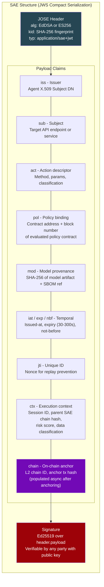

**What this gives you that logs do not:**

| Property | How |
|---|---|
| Non-repudiation | Asymmetric signature: the signing key is in HSM, not on the agent |
| Integrity | Any byte change invalidates the signature |
| Replay prevention | Short-lived expiry + unique `jti` nonce |
| Policy binding | `pol` claim locks the exact smart contract address and block number: policy code is immutable on-chain, retroactive tampering is impossible |
| Provenance binding | `mod` claim locks the exact model hash: detects model swaps |
| Causal chaining | `ctx.parent_chain` links multi-step agent workflows into a verifiable DAG |
| Independent verifiability | Any party with the public key and OCSP response can verify, offline |
| On-chain proof of existence | `chain.anchor_tx` links to the L2 transaction that anchored this SAE's hash: verifiable by anyone on-chain |

---

## 8. Multi-Agent Workflow: Chain of Custody

Real agent systems are not single-step. A procurement workflow might chain 4-5 agents across systems. The trust layer maintains cryptographic chain of custody across the entire execution DAG, with every SAE hash anchored on-chain.

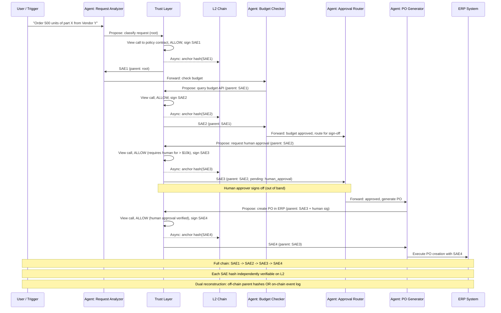

Every step is independently signed and anchored on-chain. The `parent_chain` field in each SAE points to the hash of the previous SAE, forming a verifiable DAG. The on-chain event log provides a second reconstruction path: even if off-chain SAE storage is lost, the chain of custody can be verified from L2 events alone.

---

## 9. Kill Chain & Mitigation Mapping

Mapping trust layer controls against an AI-specific attack lifecycle.

```mermaid
graph TB
    subgraph "AI Agent Kill Chain with Trust Layer Coverage"
        direction TB

        KC1["1. RECONNAISSANCE<br/>Map agent capabilities and scope"]
        M1["Mitigation: Capability obfuscation,<br/>minimal tool surface exposure"]

        KC2["2. SUPPLY CHAIN<br/>Poisoned weights, malicious adapters"]
        M2["Mitigation: Model provenance via AI-SBOM,<br/>SLSA attestation, runtime hash verification"]

        KC3["3. INITIAL ACCESS<br/>Prompt injection, RAG poisoning"]
        M3["Mitigation: Even if injection succeeds,<br/>execution requires signed authorization"]

        KC4["4. EXECUTION<br/>Unauthorized API calls, replay"]
        M4["Mitigation: Smart contract policy validation,<br/>SAE with nonce + expiry, TOCTOU-safe<br/>via immutable on-chain policy"]

        KC5["5. PRIVILEGE ESCALATION<br/>Tool chaining, inherited permissions"]
        M5["Mitigation: Per-action least privilege,<br/>JIT scoping, short-lived certs (24h)"]

        KC6["6. LATERAL MOVEMENT<br/>Agent-to-agent pivoting"]
        M6["Mitigation: mTLS agent mesh,<br/>cross-agent policies on shared L2,<br/>on-chain allowlisting"]

        KC7["7. OUTPUT MANIPULATION<br/>Insecure outputs, malicious content,<br/>data exfiltration via responses"]
        M7["Mitigation: Runtime security platforms<br/>scan outputs. Trust layer adds signed<br/>provenance binding to every response"]

        KC8["8. IMPACT<br/>Data exfil, financial fraud, infra damage"]
        M8["Mitigation: Blockchain-anchored audit trail,<br/>on-chain agent revocation,<br/>forensic chain of custody"]
    end

    KC1 --- M1
    KC2 --- M2
    KC3 --- M3
    KC4 --- M4
    KC5 --- M5
    KC6 --- M6
    KC7 --- M7
    KC8 --- M8

    style KC1 fill:#264653,color:#fff
    style KC2 fill:#264653,color:#fff
    style KC3 fill:#264653,color:#fff
    style KC4 fill:#264653,color:#fff
    style KC5 fill:#264653,color:#fff
    style KC6 fill:#264653,color:#fff
    style KC7 fill:#264653,color:#fff
    style KC8 fill:#264653,color:#fff
    style M2 fill:#e76f51,color:#fff
    style M3 fill:#e76f51,color:#fff
    style M4 fill:#e76f51,color:#fff
    style M5 fill:#e76f51,color:#fff
    style M6 fill:#e76f51,color:#fff
    style M7 fill:#e9c46a,color:#000
    style M8 fill:#e76f51,color:#fff
```

AI security platforms address Stages 2, 3, and 7 with model scanning, input filtering, and output guardrails. The trust layer covers Stages 2, 4, 5, 6, and 8: the execution and post-execution stages where autonomous action creates actual damage. Immutable on-chain policy eliminates TOCTOU attacks at Stage 4.

---

## 10. Integration Architecture: SIEM / XDR / SOAR

The trust layer is not a standalone product. It emits structured events from two sources (off-chain service events and on-chain contract events) into the existing security operations stack, and consumes signals from it.

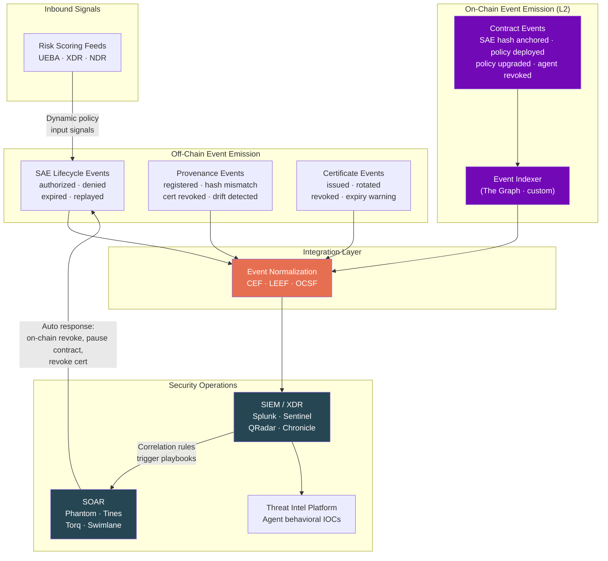

The integration is bidirectional. Off-chain events (SAE lifecycle, provenance, certificates) and on-chain contract events (hash anchoring, policy deployments, agent revocations) are normalized into OCSF and fed into SIEM. On-chain events are indexed via The Graph or a custom indexer.

SOAR playbooks can trigger both off-chain and on-chain responses: revoking certificates (off-chain), pausing a policy contract (on-chain transaction), or deactivating an agent in the on-chain registry. Risk scores from XDR/UEBA feed into policy evaluation, so a high-risk endpoint score automatically elevates the policy threshold.

**Event schema:** All events conform to OCSF for vendor-neutral ingestion, with CEF/LEEF mappings for legacy SIEM. On-chain events can be independently verified against the L2.

---

## 11. Runtime Attestation: Continuous Verification

Deployment-time verification is insufficient. The trust layer performs continuous runtime checks on six dimensions, including on-chain state verification.

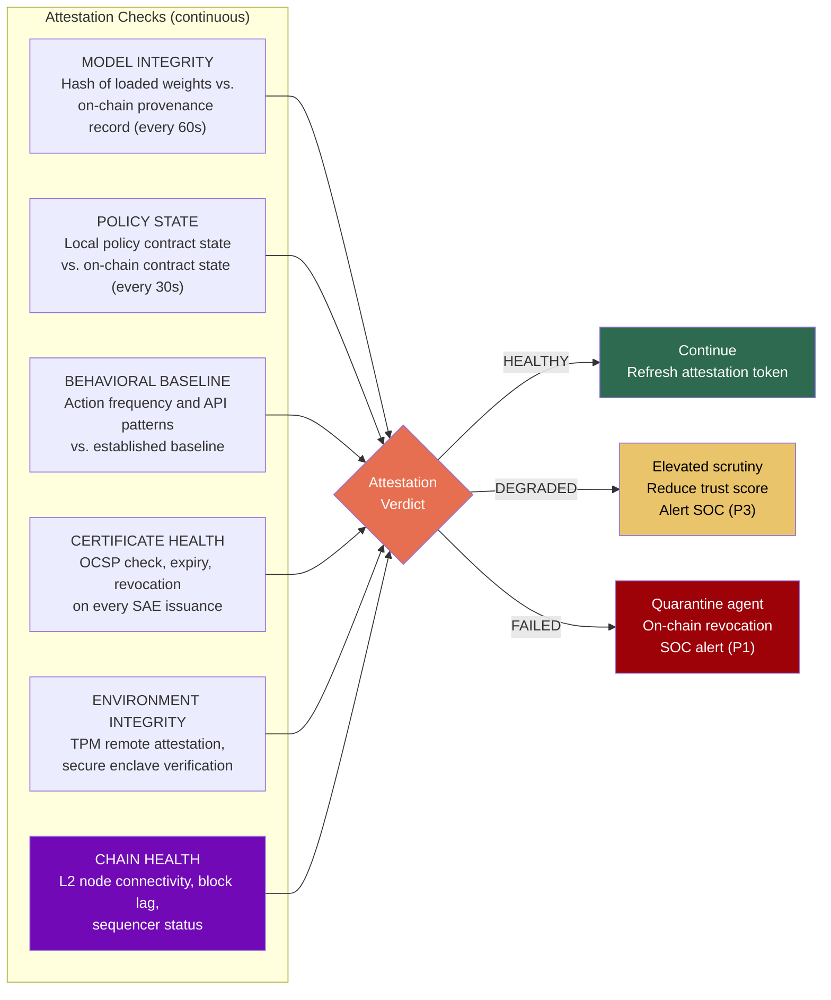

The three-state model (healthy / degraded / failed) avoids hard-blocking on transient issues. A degraded state tightens controls without killing the agent, similar to how EDR quarantines vs. kills a process. If the L2 node is unreachable, the system degrades to cached policy state. A failed state triggers both certificate revocation and on-chain agent deactivation.

---

## 12. Immutable Audit: Tiered Anchoring

Not every AI event needs on-chain immutability. The trust layer applies tiered anchoring based on trust criticality. The blockchain replaces the custom Merkle tree and transparency log: the L2 chain natively provides both.

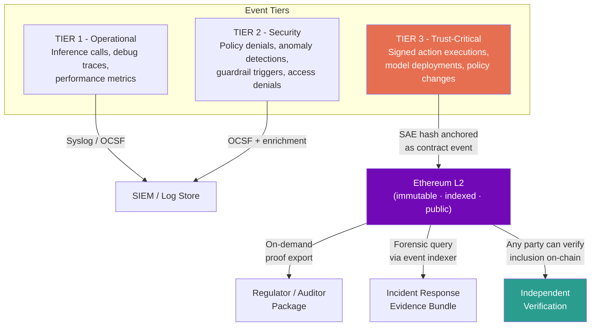

The L2 blockchain serves as both the Merkle tree and the transparency log. SAE hashes are emitted as indexed contract events: any party can verify that a specific SAE existed at the claimed time by querying the chain, without trusting the trust layer operator. No custom Merkle tree, no separate transparency log, no periodic root hash publication. The chain does all three natively.

---

## 13. Incident Response: Forensic Workflow

Scenario: SOC detects an unauthorized $200k wire transfer initiated by an AI agent.

Without the trust layer: the SOC reconstructs this from scattered, mutable logs across 4+ systems. It takes days. The evidence is legally contestable. With the trust layer: cryptographic proof in minutes, including the exact policy smart contract version that was evaluated. Every SAE hash is verifiable on-chain, the policy contract code is immutable and auditable, and the full causal chain can be reconstructed from L2 event logs even if off-chain storage is compromised.

---

## 14. Defense-in-Depth: Where This Sits

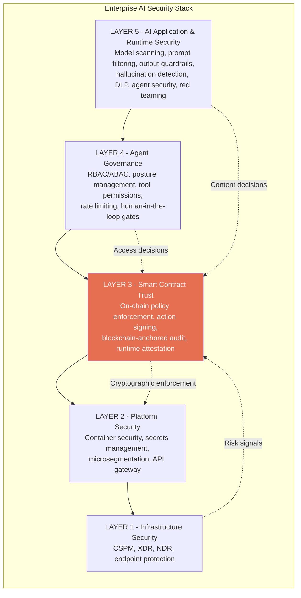

Layer 3 does not replace anything above or below it. It makes the decisions at every other layer **provable and on-chain**:

- Layer 5 detects a risky prompt: Layer 3 proves the action was blocked
- Layer 4 decides an agent lacks permission: Layer 3 produces a signed denial
- Layer 1 detects an endpoint anomaly: Layer 3 tightens policy thresholds

The blockchain is the shared trust substrate. Every decision above or below Layer 3 can be cryptographically verified on-chain.

---

## 15. Zero Trust for AI: NIST 800-207 Mapping

| NIST ZTA Principle | Traditional Implementation | AI Trust Layer Implementation |
|---|---|---|
| All resources require verification | Device posture, user identity | Agent identity (X.509), model provenance, on-chain agent registry |
| Communication secured regardless of location | mTLS, VPN, ZTNA | mTLS agent mesh + signed action envelopes with on-chain anchoring |
| Per-session resource access | Session tokens, JIT access | Per-action smart contract policy evaluation, no standing privileges |
| Dynamic policy enforcement | ABAC, risk-adaptive access | Smart contract policy with real-time context (risk score, time, classification) |
| Continuous monitoring of asset posture | EDR, UEBA, vulnerability scanning | Runtime attestation (model hash vs. on-chain record, policy contract state, chain health) |
| Strict authentication and authorization | MFA, SSO, conditional access | Smart contract enforcement: no execution without valid SAE |

---

## 16. Regulatory Alignment

| Regulation | Key Requirement | Trust Layer Mapping |
|---|---|---|
| **EU AI Act** | Traceability, logging, human oversight for high-risk AI | On-chain SAE chain of custody, smart contract-gated human escalation |
| **NIST AI RMF** | Govern, Map, Measure, Manage AI risk | On-chain provenance, runtime attestation, continuous smart contract policy evaluation |
| **SOX §404** | Internal controls over financial reporting | Smart contract-enforced authorization for financial AI actions, blockchain-anchored audit |
| **DORA** | Digital operational resilience (EU financial sector) | Blockchain-immutable audit, on-chain incident reconstruction, third-party agent verification via shared L2 |
| **PCI DSS v4.0** | Cardholder data protection | DLP integration via policy smart contracts, signed actions on payment APIs |
| **FedRAMP / FISMA** | Continuous monitoring, tamper-evident logging | Runtime attestation, blockchain-anchored audit trail |
| **ISO 27001:2022** | Information security management | Agent PKI, smart contract access control, on-chain audit trail |

---

## Appendix A: Glossary

| Term | Definition |
|---|---|
| **SAE** | Signed Action Envelope - JWS object binding agent identity, policy, action, provenance, and timestamp into a single verifiable artifact. Hash anchored on-chain |
| **PDP** | Policy Decision Point - evaluates whether an action is permitted by calling view functions on policy smart contracts |
| **PEP** | Policy Enforcement Point - verifies SAE signature at execution boundary; rejects unsigned actions |
| **Smart Contract** | Self-executing code deployed on a blockchain that enforces rules without intermediaries. In this architecture, smart contracts encode policy logic and anchor SAE hashes |
| **L2 / Layer 2** | A secondary blockchain that inherits security from a Layer 1 (Ethereum) while providing higher throughput and lower costs. Examples: Arbitrum, Optimism, Base |
| **EVM** | Ethereum Virtual Machine - the runtime environment for smart contracts on Ethereum and compatible L2 chains |
| **View Function** | A smart contract function that reads state without modifying it. Requires no gas, executes locally against cached chain state. Used for policy evaluation |
| **Contract Event** | A log entry emitted by a smart contract during execution. Indexed and permanently stored on-chain. Used for SAE hash anchoring and audit |
| **secp256k1** | The elliptic curve used by Ethereum for transaction signing. HSM-backed secp256k1 keys enable enterprise-grade blockchain operations |
| **The Graph** | A decentralized indexing protocol for querying blockchain data. Used to index and query on-chain SAE anchor events and policy contract state |
| **Multisig** | A wallet that requires multiple signatures (e.g., 3-of-5) to authorize a transaction. Used for contract ownership and policy upgrade governance |
| **Timelock** | A smart contract mechanism that delays execution of authorized actions by a configurable period, making hostile contract upgrades publicly visible before they take effect |
| **AI-SBOM** | AI Software Bill of Materials - manifest of model components: base model, fine-tune data, adapters, dependencies |
| **SLSA** | Supply-chain Levels for Software Artifacts - framework for supply chain integrity applied to model provenance |
| **SPIFFE/SPIRE** | Secure Production Identity Framework - standard for issuing and rotating workload identities; used for agent certificate provisioning |
| **OCSF** | Open Cybersecurity Schema Framework - vendor-neutral event schema for SIEM interoperability |
| **CEF/LEEF** | Common Event Format / Log Event Extended Format - standard event formats for SIEM ingestion |
| **TOCTOU** | Time-of-Check to Time-of-Use - race condition between policy evaluation and action execution. Mitigated by immutable on-chain policy state |
| **OCSP** | Online Certificate Status Protocol - real-time certificate revocation checking |
| **mTLS** | Mutual TLS - both parties authenticate via certificates during TLS handshake |
| **HSM** | Hardware Security Module - tamper-resistant hardware for key storage and cryptographic operations. Backs both PKI keys and blockchain wallet keys |
| **Merkle Patricia Trie** | The data structure underlying Ethereum's state storage. Every block commits to a state root that cryptographically covers all contract state, providing built-in proof of inclusion |

---

## Appendix B: Open Questions

Areas where I am looking for feedback and pressure-testing from security leaders.

1. **L2 chain selection** - Arbitrum vs. Optimism vs. Base vs. private rollup. What are the trade-offs between public L2 (maximum transparency, cross-org trust) and an enterprise-operated rollup (full control, data privacy)? Is there a hybrid where policy contracts live on a public L2 but sensitive SAE metadata goes to a private chain?
2. **Contract upgrade governance** - Multisig with timelock is the baseline. Should contract upgrades require on-chain governance votes? What's the right delay period before policy changes take effect? Who holds the multisig keys in an enterprise?
3. **Agent identity standard** - No industry standard exists yet for AI agent identity. Is this a SPIFFE extension with on-chain registration? A new X.509 profile that maps to blockchain addresses? Or a fully on-chain identity system?
4. **L2 sequencer risk** - L2 sequencers are centralized by design. If the sequencer goes down, SAE hash anchoring is delayed. How should the system degrade? Fallback to off-chain-only mode with a reanchoring queue? Multiple L2s for redundancy?
5. **Gas cost optimization** - At 1M+ SAEs per hour, individual on-chain transactions are expensive even on L2. Batch anchoring (Merkle root of N SAE hashes per transaction) reduces cost 100-1000x. What's the right batch size vs. anchoring latency trade-off?
6. **Privacy vs. transparency** - Enterprise policy rules on a public chain expose security posture. ZK proofs could prove policy was evaluated correctly without revealing the rules. Is the complexity worth it? Are enterprises ready for ZK infrastructure?
7. **Cross-chain interoperability** - If different organizations use different L2s, how do cross-org agent interactions verify each other's policy contracts? Bridge protocols? Shared settlement on L1? Standard contract interfaces?
8. **Go-to-market** - Should this land first with the CISO organization, platform engineering, or AI/ML teams? Does the blockchain component change who the buyer is?
